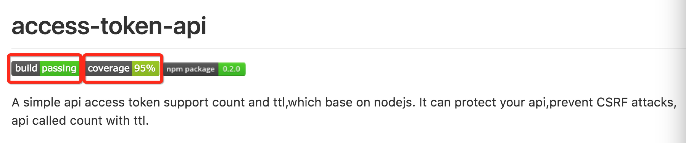
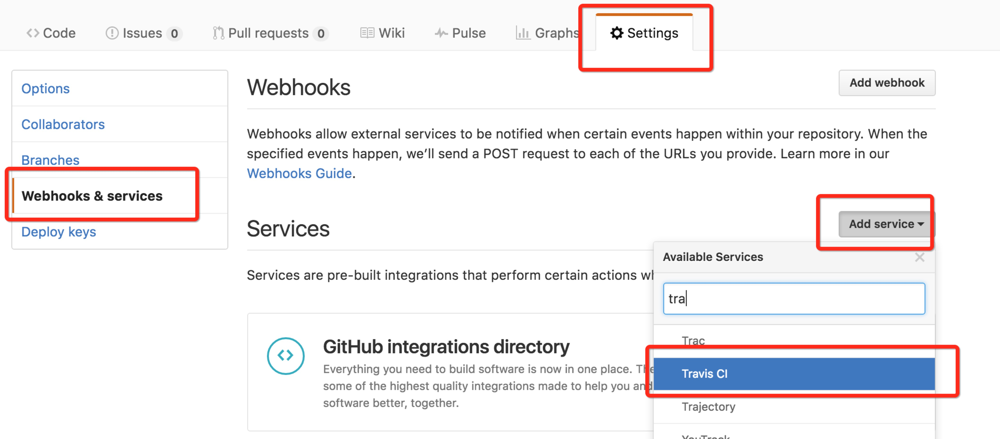
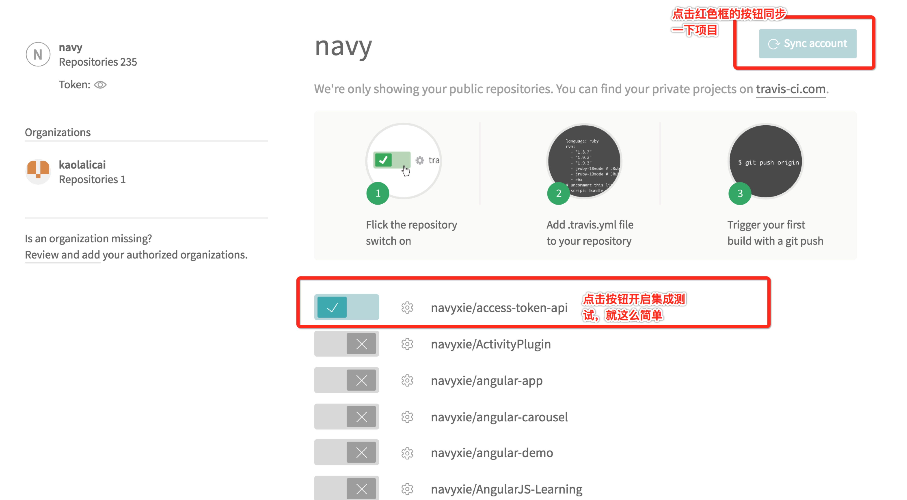
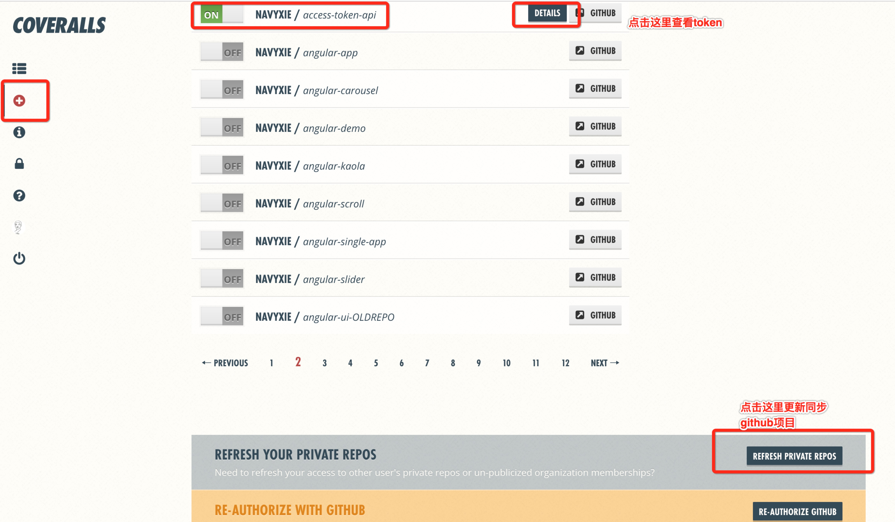
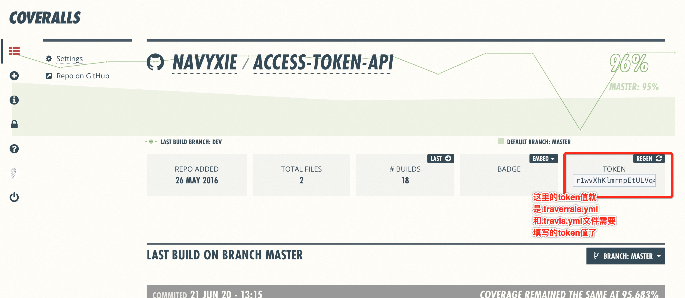

# travis-ci and coveralls demo

当项目托管在github时，可以利用[travis-ci](https://travis-ci.org)来进行集成测试，并且通过[coveralls](https://coveralls.io/)来显示项目的代码测试覆盖率。这样整个项目给人的感觉会比较可靠稳定。效果图如下所示：
 
第一个红框build passing 代表项目测试通过，第二个红框代表项目测试的覆盖率。

**下面介绍配置完成这个配置的步骤 （7个步骤，很简单）：**

1 配置你在github上项目，开启travis-ci hook,如下图：
  
2 登录（使用你的github账户授权登录，可能需要翻墙）[https://travis-ci.org](https://travis-ci.org)官网去开启项目，如下图：
  
3 登录（使用你的github账户授权登录，可能需要翻墙）[https://coveralls.io](https://coveralls.io)官网去获取项目的token，如下图：
  
  
4 配置.coveralls.yml文件，你的代码覆盖率将会根据配置文件（repo_token）更新到对应的项目，如下图：
  
